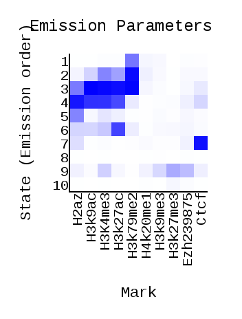
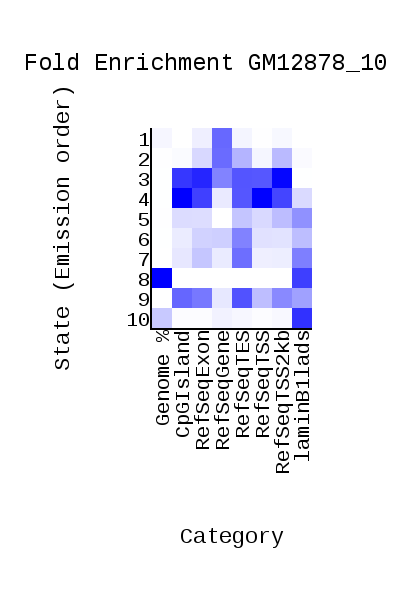
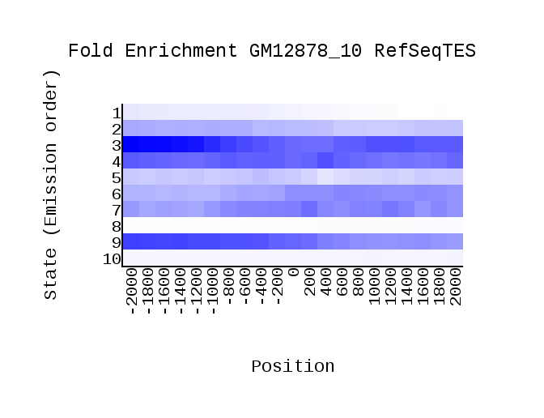
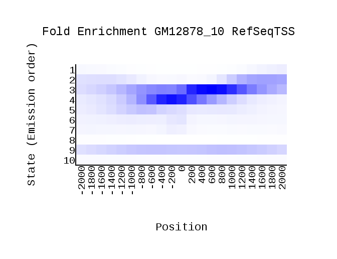
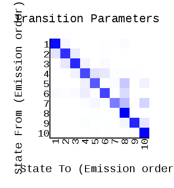

# hse_hw3_chromhmm

# Домашнее задание №3

> ### Введение:
>
>Целью данного домашнего задания является разбивка (аннотация) генома человека на разные типы эпигенетических состояний. Это будет сделано на основании данных о наличии различных гистоновых модификаций (гистоновый код) в соответствующих участках генома. Для выполнения этого задания мы будем работать с чтениями, полученными в ChIP-seq экспериментах из проекта ENCODE (https://www.encodeproject.org/), которые были выровнены на геном человека (версия hg19) – т.е. у нас будут уже готовые bam-файлы. Автоматическая разбивка генома на эпигенетические типы будет осуществляться с помощью программы ChromHMM. В результате итеративной процедуры (алгоритм Баума-Велша) программа определит сочетание гистоновых меток, которые характерны для каждого из N разных эпигенетических типов (число N указывается пользователем при запуске программы). Наша задача будет заключаться в том, чтобы на основании косвенных независимых наблюдений вручную приписать каждому из N эпигенетических типов возможную биологическую функцию.

> ### Ссылка на мой google colab ноутбук: https://colab.research.google.com/drive/1yPmQpcJ6MaZwl8xGq8E8gRiqjODjpzMK?usp=sharing

## Часть №1:

> В домашнем задании №2 рассматривалась клеточная линия PC-9. Так как она не содержит ChIP-seq эксперименты в рассматриваемых гистоновых метках для ДЗ№3, то была взята другая клеточная линия - GM12878. Гистоновая метка из ДЗ№2 - H3k4me3.
> 

### Список гистоновых меток и ссылки на bam-файлы

| № | Гистоновая метка | Ссылка на bam-файл |
|:-:|:----------------:|:------------------:|
| 1 |H3k4me3|http://hgdownload.cse.ucsc.edu/goldenPath/hg19/encodeDCC/wgEncodeBroadHistone/wgEncodeBroadHistoneGm12878H3k4me3StdAlnRep1.bam|
| 2 |Ctcf|http://hgdownload.cse.ucsc.edu/goldenPath/hg19/encodeDCC/wgEncodeBroadHistone/wgEncodeBroadHistoneGm12878CtcfStdAlnRep1.bam|
| 3 |Ezh239875|http://hgdownload.cse.ucsc.edu/goldenPath/hg19/encodeDCC/wgEncodeBroadHistone/wgEncodeBroadHistoneGm12878Ezh239875AlnRep1.bam|
| 4 |H2az|http://hgdownload.cse.ucsc.edu/goldenPath/hg19/encodeDCC/wgEncodeBroadHistone/wgEncodeBroadHistoneGm12878H2azStdAlnRep1.bam|
| 5 |H4k20me1|http://hgdownload.cse.ucsc.edu/goldenPath/hg19/encodeDCC/wgEncodeBroadHistone/wgEncodeBroadHistoneGm12878H4k20me1StdAlnRep1.bam|
| 6 |H3k79me2|http://hgdownload.cse.ucsc.edu/goldenPath/hg19/encodeDCC/wgEncodeBroadHistone/wgEncodeBroadHistoneGm12878H3k79me2StdAlnRep1.bam|
| 7 |H3k9ac|http://hgdownload.cse.ucsc.edu/goldenPath/hg19/encodeDCC/wgEncodeBroadHistone/wgEncodeBroadHistoneGm12878H3k9acStdAlnRep1.bam|
| 8 |H3k9me3|http://hgdownload.cse.ucsc.edu/goldenPath/hg19/encodeDCC/wgEncodeBroadHistone/wgEncodeBroadHistoneGm12878H3k9me3StdAlnRep1.bam|
| 9 |H3k27ac|http://hgdownload.cse.ucsc.edu/goldenPath/hg19/encodeDCC/wgEncodeBroadHistone/wgEncodeBroadHistoneGm12878H3k27acStdAlnRep1.bam|
| 10 |H3k27me3|http://hgdownload.cse.ucsc.edu/goldenPath/hg19/encodeDCC/wgEncodeBroadHistone/wgEncodeBroadHistoneGm12878H3k27me3StdAlnRep1.bam|

### Файл с контрольным экспериментом для соответствующего типа клеток 
>
> http://hgdownload.cse.ucsc.edu/goldenPath/hg19/encodeDCC/wgEncodeBroadHistone/wgEncodeBroadHistoneGm12878ControlStdAlnRep1.bam
>
> 

### Сформированный текстовый файл cellmarkfiletable.txt - [cellmarkfiletable.txt]
> (https://github.com/galkinamariia/hse_hw3_chromhmm/blob/main/cellmarkfiletable.txt)
>
> 

### ChromHMM
>
> Папка с сформировавшимися файлами - [ChromHMM](https://github.com/galkinamariia/hse_hw3_chromhmm/tree/main/ChromHMM)
>
> 
> 
> 

### Эпигетические типы

| № Состояния | Эпигенетический тип | Встречаемость в гистоновых модификациях | Описание | Изображение из USCC |
|:---------:|:-------------------:|---------------------------------------|--------|:-------------------:|
| 1 ||Встречается почти во всех, но чаще всего в: <ul><li>H3k79me2|Чаще всего ассоциировано с: <ul><li>RefSeqGene||
| 2 ||Встречается во всех, но чаще всего в: <ul><li>H3k79me2<li>H3K4me3<li>H3k27ac<li>H3k9ac|Чаще всего ассоциировано с: <ul><li>RefSeqGene<li>RefSeqTES<li>RefSeqTSS2kb||
| 3 ||Встречается во всех, но чаще всего в: <ul><li>H3k79me2<li>H3K4me3<li>H3k27ac<li>H3k9ac<li>H2az|Чаще всего ассоциировано с: <ul><li>CpGIsland<li>RefSeqExon<li>RefSeqGene<li>RefSeqTES<li>RefSeqTSS<li>RefSeqTSS2kb||
| 4 ||Встречается во всех, но чаще всего в: <ul><li>H2az<li>H3k27ac<li>H3K4me3<li>H3k9ac<li>Ctcf|Чаще всего ассоциировано с: <ul><li>CpGIsland<li>RefSeqExon<li>RefSeqTES<li>RefSeqTSS<li>RefSeqTSS2kb||
| 5 ||Встречается почти во всех, но чаще всего в: <ul><li>H2az<li>H3K4me3|Чаще всего ассоциировано с: <ul><li>laminB1lands<li>RefSeqTES<li>RefSeqTSS2kb||
| 6 ||Встречается во всех, но чаще всего в: <ul><li>H3k27ac<li>H2az<li>H3k9ac<li>H3K4me3<li>H3k79me2|Чаще всего ассоциировано с: <ul><li>RefSeqTES<li>laminB1lands<li>RefSeqExon<li>RefSeqGene||
| 7 ||Редко встречается, наиболее часто в: <ul><il>Ctcf<li>H2az<li>Ezh239875|Чаще всего ассоциировано с: <ul><li>RefSeqTES<li>laminB1lands<li>RefSeqExon||
| 8 |Heterochromatin|Почти не встречается|Данное состояние попадает на интрон гена и показывает низкий сигнал. Чаще всего ассоциировано с ядерной ламиной, т.е. попадает на участок репрессированного гетерохроматина. Чаще всего ассоциировано с: <ul><li>Genome<li>laminB1lands||
| 9 ||Встречается во всех, но чаще всего в: <ul><li>H3k27me3<li>Ezh239875<li>H3K4me3<li>H3k9me3|Чаще всего ассоциировано с: <ul><li>RefSeqTES<li>CpGIsland<li>RefSeqExon<li>RefSeqTSS2kb<li>laminB1lands||
| 10 |Heterochromatin|Почти не встречается, кроме: <ul><li>H3k27me3|Данное состояние попадает на интрон гена и показывает низкий сигнал. Чаще всего ассоциировано с ядерной ламиной, т.е. попадает на участок репрессированного гетерохроматина. Чаще всего ассоциировано с: <ul><li>laminB1lands<li>Genome||

## Часть №2:
